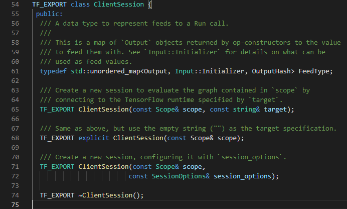

# TensorFlow 2.5 in C++
The C++ version of the multi model script is used to load the LinearRegressionModel for inference on the generated dataset from the python code.

## Setup
Install bazel https://docs.bazel.build/versions/3.7.2/install.html <br>


Clone the TensorFlow repository and prepare include and lib directories
```
mkdir -p tensorflow/git/ tensorflow/include tensorflow/lib
cd tensorflow/git
git clone --recursive --branch r2.5 https://github.com/tensorflow/tensorflow
cd tensorflow
```

Configure the bazel build in the tensorflow directory
```
./configure
```

To run the code, we first need to fix a lot of symbol errors due to the maximum symbol limit of 60000, which TensorFlow exceeds. <br>
I have created a patch of the imports that are needed for the example code.
```
git apply ../../../win-10-tf-2-5.patch
```

Building the TensorFlow source code with Bazel (make sure you are in bash or MSYS2) <br>
Build Dynamic-link libraries (dll) and import libraries (lib)
```
bazel build -c opt --copt=-nvcc_options=disable-warnings --define=no_tensorflow_py_deps=true --config=cuda tensorflow:tensorflow_cc.dll
bazel build -c opt --copt=-nvcc_options=disable-warnings --define=no_tensorflow_py_deps=true --config=cuda tensorflow:tensorflow_cc.lib
```

Build header files
```
bazel build -c opt --copt=-nvcc_options=disable-warnings --define=no_tensorflow_py_deps=true --config=cuda tensorflow:install_headers
```

Copy `tensorflow_cc.dll` and `tensorflow_cc.lib` from `bazel-bin\tensorflow` to the lib folder. Lastly, copy the headers to the include folder.
```
cp bazel-bin/tensorflow/tensorflow_cc.dll ../../lib/
cp bazel-bin/tensorflow/tensorflow_cc.lib ../../lib/
cp -r bazel-bin/tensorflow/include/ ../../
```

## Running the code
Running the code should output the TensorFlow version and a Matplotlib figure presenting the LinearRegressionModel and the dataset from generated in Python:
```
2021-06-14 02:31:49.288685: I tensorflow/stream_executor/platform/default/dso_loader.cc:53] Successfully opened dynamic library cudart64_110.dll
C++ TensorFlow version: 2.5.0, Git version: v2.5.0-17-g15d5b930d7e
2021-06-14 02:31:49.395636: I tensorflow/cc/saved_model/reader.cc:38] Reading SavedModel from: ../../../../LinearRegressionModel/
2021-06-14 02:31:49.396337: I tensorflow/cc/saved_model/reader.cc:90] Reading meta graph with tags { serve }
2021-06-14 02:31:49.396391: I tensorflow/cc/saved_model/reader.cc:132] Reading SavedModel debug info (if present) from: ../../../../LinearRegressionModel/
2021-06-14 02:31:49.400881: I tensorflow/core/platform/cpu_feature_guard.cc:142] This TensorFlow binary is optimized with oneAPI Deep Neural Network Library (oneDNN) to use the following CPU instructions in performance-critical operations:  AVX AVX2
To enable them in other operations, rebuild TensorFlow with the appropriate compiler flags.
2021-06-14 02:31:49.413104: I tensorflow/stream_executor/platform/default/dso_loader.cc:53] Successfully opened dynamic library nvcuda.dll
2021-06-14 02:31:49.453680: I tensorflow/core/common_runtime/gpu/gpu_device.cc:1733] Found device 0 with properties:
pciBusID: 0000:01:00.0 name: GeForce RTX 2080 computeCapability: 7.5
coreClock: 1.815GHz coreCount: 46 deviceMemorySize: 8.00GiB deviceMemoryBandwidth: 417.23GiB/s
2021-06-14 02:31:49.453786: I tensorflow/stream_executor/platform/default/dso_loader.cc:53] Successfully opened dynamic library cudart64_110.dll
2021-06-14 02:31:49.465122: I tensorflow/stream_executor/platform/default/dso_loader.cc:53] Successfully opened dynamic library cublas64_11.dll
2021-06-14 02:31:49.465218: I tensorflow/stream_executor/platform/default/dso_loader.cc:53] Successfully opened dynamic library cublasLt64_11.dll
2021-06-14 02:31:49.468680: I tensorflow/stream_executor/platform/default/dso_loader.cc:53] Successfully opened dynamic library cufft64_10.dll
2021-06-14 02:31:49.470615: I tensorflow/stream_executor/platform/default/dso_loader.cc:53] Successfully opened dynamic library curand64_10.dll
2021-06-14 02:31:49.475487: I tensorflow/stream_executor/platform/default/dso_loader.cc:53] Successfully opened dynamic library cusolver64_11.dll
2021-06-14 02:31:49.478930: I tensorflow/stream_executor/platform/default/dso_loader.cc:53] Successfully opened dynamic library cusparse64_11.dll
2021-06-14 02:31:49.480112: I tensorflow/stream_executor/platform/default/dso_loader.cc:53] Successfully opened dynamic library cudnn64_8.dll
2021-06-14 02:31:49.480282: I tensorflow/core/common_runtime/gpu/gpu_device.cc:1871] Adding visible gpu devices: 0
2021-06-14 02:31:49.875159: I tensorflow/core/common_runtime/gpu/gpu_device.cc:1258] Device interconnect StreamExecutor with strength 1 edge matrix:
2021-06-14 02:31:49.875292: I tensorflow/core/common_runtime/gpu/gpu_device.cc:1264]      0
2021-06-14 02:31:49.876008: I tensorflow/core/common_runtime/gpu/gpu_device.cc:1277] 0:   N
2021-06-14 02:31:49.876447: I tensorflow/core/common_runtime/gpu/gpu_device.cc:1418] Created TensorFlow device (/job:localhost/replica:0/task:0/device:GPU:0 with 5961 MB memory) -> physical GPU (device: 0, name: GeForce RTX 2080, pci bus id: 0000:01:00.0, compute capability: 7.5)
2021-06-14 02:31:49.909530: I tensorflow/cc/saved_model/loader.cc:206] Restoring SavedModel bundle.
2021-06-14 02:31:50.122484: I tensorflow/cc/saved_model/loader.cc:190] Running initialization op on SavedModel bundle at path: ../../../../LinearRegressionModel/
2021-06-14 02:31:50.124970: I tensorflow/cc/saved_model/loader.cc:277] SavedModel load for tags { serve }; Status: success: OK. Took 729334 microseconds.
```


## Help
Fixing unresolved symbol errors <br>
Example error:
```
Severity	Code	Description	Project	File	Line	Suppression State
Error	LNK2019	unresolved external symbol "public: __cdecl tensorflow::ClientSession::ClientSession(class tensorflow::Scope const &)" (??0ClientSession@tensorflow@@QEAA@AEBVScope@1@@Z) referenced in function main	
...\multi-language-tf-model\CPP\out\build\x64-Debug\multi-language-tf-model	...\multi-language-tf-model\CPP\out\build\x64-Debug\main.cpp.obj	1	
```
Add `#include "tensorflow/core/platform/macros.h"` to the top of the file and add the `TF_EXPORT` macro infront of any symbols which provide errors when building.
Example (`CPP\tensorflow\git\tensorflow\tensorflow\cc\client\client_session.h`): <br>


Then rebuild the code with bazel.

## Sources used
https://dkjoi.medium.com/tf2-4-dll-with-gpu-support-for-3090-in-windows-305126bc0d17
