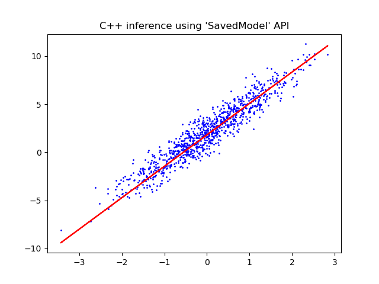

# Using TensorFlow 2.5 with GPU in Python, C and C++
This repository aims to create a simple LinearRegressionModel which can be used in Python, C and C++ using the `SavedModel` API.

## Setup
TensorFlow GPU support requires an assortment of drivers and libraries.

Install CUDA https://developer.download.nvidia.com/compute/cuda/11.2.2/local_installers/cuda_11.2.2_461.33_win10.exe <br>
Install cuDNN https://developer.nvidia.com/compute/machine-learning/cudnn/secure/8.1.1.33/11.2_20210301/cudnn-11.2-windows-x64-v8.1.1.33.zip <br>
Unzip and move cudnn libraries to cuda folder. <br>
Copy `downloadpath\cuda\bin\cudnn*.dll` to `C:\Program Files\NVIDIA GPU Computing Toolkit\CUDA\v11.2\bin`. <br>
Copy `downloadpath\cuda\include\cudnn*.h` to `C:\Program Files\NVIDIA GPU Computing Toolkit\CUDA\v11.2\include`. <br>
Copy `downloadpath\cuda\lib\x64\cudnn*.lib` to `C:\Program Files\NVIDIA GPU Computing Toolkit\CUDA\v11.2\lib\x64`. <br>
Each directory (`Python`, `C`, `CPP`) contains a `README.md` file explaining additional installation and build steps for the specific language.

## LinearRegressionModel 
The Python version of the multi model script is used to create a LinearRegressionModel for a set of predefined parameters.
This model is saved using the `SavedModel` API to be used in other languages.

### Python
Running the code in Visual Studio should output (short version):
```
Python TensorFlow version: 2.5.0
...
Epoch 10/10
1/1 [==============================] - ETA: 0s - loss: 1.1684
1/1 [==============================] - 0s 1ms/step - loss: 1.1684
...
Saving LinearRegressionModel...
Saved LinearRegressionModel!
Saving generated dataset...
Saved generated dataset!
...
signature_def['serving_default']:
  The given SavedModel SignatureDef contains the following input(s):
    inputs['x'] tensor_info:
        dtype: DT_FLOAT
        shape: unknown_rank
        name: serving_default_x:0
  The given SavedModel SignatureDef contains the following output(s):
    outputs['output'] tensor_info:
        dtype: DT_FLOAT
        shape: unknown_rank
        name: StatefulPartitionedCall:0
  Method name is: tensorflow/serving/predict
```
And present a Matplotlib Figure of the LinearRegression in red over the synthetic data in blue.


### C
Running the code in Visual Studio should output:
```
2021-06-11 11:07:38.444233: I tensorflow/stream_executor/platform/default/dso_loader.cc:53] Successfully opened dynamic library cudart64_110.dll
C TensorFlow version: 2.5.0 
```
> NOTE: Not yet implemented!

### C++
Running the code in Visual Studio should output:
```
2021-06-11 11:02:34.147258: I tensorflow/stream_executor/platform/default/dso_loader.cc:53] Successfully opened dynamic library cudart64_110.dll
C++ TensorFlow version: 2.5.0, Git version: v2.5.0-17-g15d5b930d7e 
2021-06-14 02:31:49.395636: I tensorflow/cc/saved_model/reader.cc:38] Reading SavedModel from: ../../../../LinearRegressionModel/
2021-06-14 02:31:49.396337: I tensorflow/cc/saved_model/reader.cc:90] Reading meta graph with tags { serve }
2021-06-14 02:31:49.396391: I tensorflow/cc/saved_model/reader.cc:132] Reading SavedModel debug info (if present) from: ../../../../LinearRegressionModel/
...
2021-06-14 02:31:49.909530: I tensorflow/cc/saved_model/loader.cc:206] Restoring SavedModel bundle.
2021-06-14 02:31:50.122484: I tensorflow/cc/saved_model/loader.cc:190] Running initialization op on SavedModel bundle at path: ../../../../LinearRegressionModel/
2021-06-14 02:31:50.124970: I tensorflow/cc/saved_model/loader.cc:277] SavedModel load for tags { serve }; Status: success: OK. Took 729334 microseconds. 
```
And present a Matplotlib Figure of the LinearRegression in red over the data generated from Python in blue.


## Sources used
https://www.tensorflow.org/install <br>
https://www.tensorflow.org/guide/saved_model <br>
