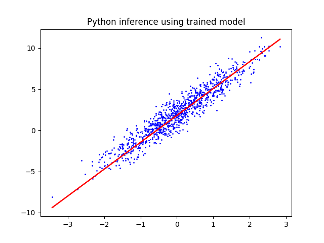

# TensorFlow 2.5 in Python 3
The Python version of the multi model script is used to create a LinearRegressionModel for a set of predefined parameters.
This model is saved using the `SavedModel` API to be used in other languages.

## Setup
Create the virtual environment.
```
python -m venv tf2.5-env
```

Active the environment.
```
source tf2.5-env/Scripts/activate
```
> NOTE: When on Windows run `tf2.5-env\Scripts\activate` instead (without source).

Install the python requirements
```
python -m pip install -r requirements.txt
```

## Running the code
Running the code should print out the TensorFlow version, the training loop, and a Matplotlib figure presenting the LinearRegressionModel and synthetic data.
```
python .\main.py
```
Output:
```
2021-06-13 14:58:04.261217: I tensorflow/stream_executor/platform/default/dso_loader.cc:53] Successfully opened dynamic library cudart64_110.dll
Python TensorFlow version: 2.5.0
2021-06-13 14:58:09.656399: I tensorflow/stream_executor/platform/default/dso_loader.cc:53] Successfully opened dynamic library nvcuda.dll
2021-06-13 14:58:09.680572: I tensorflow/core/common_runtime/gpu/gpu_device.cc:1733] Found device 0 with properties:
pciBusID: 0000:01:00.0 name: GeForce RTX 2080 computeCapability: 7.5
coreClock: 1.815GHz coreCount: 46 deviceMemorySize: 8.00GiB deviceMemoryBandwidth: 417.23GiB/s
2021-06-13 14:58:09.680885: I tensorflow/stream_executor/platform/default/dso_loader.cc:53] Successfully opened dynamic library cudart64_110.dll
2021-06-13 14:58:10.068183: I tensorflow/stream_executor/platform/default/dso_loader.cc:53] Successfully opened dynamic library cublas64_11.dll
2021-06-13 14:58:10.068277: I tensorflow/stream_executor/platform/default/dso_loader.cc:53] Successfully opened dynamic library cublasLt64_11.dll
2021-06-13 14:58:10.327757: I tensorflow/stream_executor/platform/default/dso_loader.cc:53] Successfully opened dynamic library cufft64_10.dll
2021-06-13 14:58:10.354815: I tensorflow/stream_executor/platform/default/dso_loader.cc:53] Successfully opened dynamic library curand64_10.dll
2021-06-13 14:58:10.553302: I tensorflow/stream_executor/platform/default/dso_loader.cc:53] Successfully opened dynamic library cusolver64_11.dll
2021-06-13 14:58:10.729689: I tensorflow/stream_executor/platform/default/dso_loader.cc:53] Successfully opened dynamic library cusparse64_11.dll
2021-06-13 14:58:11.263557: I tensorflow/stream_executor/platform/default/dso_loader.cc:53] Successfully opened dynamic library cudnn64_8.dll
2021-06-13 14:58:11.263701: I tensorflow/core/common_runtime/gpu/gpu_device.cc:1871] Adding visible gpu devices: 0
2021-06-13 14:58:11.267426: I tensorflow/core/platform/cpu_feature_guard.cc:142] This TensorFlow binary is optimized with oneAPI Deep Neural Network Library (oneDNN) to use the following CPU instructions in performance-critical operations:  AVX AVX2
To enable them in other operations, rebuild TensorFlow with the appropriate compiler flags.
2021-06-13 14:58:11.270119: I tensorflow/core/common_runtime/gpu/gpu_device.cc:1733] Found device 0 with properties:
pciBusID: 0000:01:00.0 name: GeForce RTX 2080 computeCapability: 7.5
coreClock: 1.815GHz coreCount: 46 deviceMemorySize: 8.00GiB deviceMemoryBandwidth: 417.23GiB/s
2021-06-13 14:58:11.270342: I tensorflow/core/common_runtime/gpu/gpu_device.cc:1871] Adding visible gpu devices: 0
2021-06-13 14:58:12.121224: I tensorflow/core/common_runtime/gpu/gpu_device.cc:1258] Device interconnect StreamExecutor with strength 1 edge matrix:
2021-06-13 14:58:12.121319: I tensorflow/core/common_runtime/gpu/gpu_device.cc:1264]      0
2021-06-13 14:58:12.121365: I tensorflow/core/common_runtime/gpu/gpu_device.cc:1277] 0:   N
2021-06-13 14:58:12.123092: I tensorflow/core/common_runtime/gpu/gpu_device.cc:1418] Created TensorFlow device (/job:localhost/replica:0/task:0/device:GPU:0 with 5961 MB memory) -> physical GPU (device: 0, name: GeForce RTX 2080, pci bus id: 0000:01:00.0, compute capability: 7.5)
2021-06-13 14:58:12.422198: I tensorflow/compiler/mlir/mlir_graph_optimization_pass.cc:176] None of the MLIR Optimization Passes are enabled (registered 2)
Epoch 1/10

1/1 [==============================] - ETA: 0s - loss: 8.8121
1/1 [==============================] - 1s 530ms/step - loss: 8.8121
Epoch 2/10

1/1 [==============================] - ETA: 0s - loss: 6.0207
1/1 [==============================] - 0s 2ms/step - loss: 6.0207
Epoch 3/10

1/1 [==============================] - ETA: 0s - loss: 4.2299
1/1 [==============================] - 0s 999us/step - loss: 4.2299
Epoch 4/10

1/1 [==============================] - ETA: 0s - loss: 3.0811
1/1 [==============================] - 0s 2ms/step - loss: 3.0811
Epoch 5/10

1/1 [==============================] - ETA: 0s - loss: 2.3441
1/1 [==============================] - 0s 1ms/step - loss: 2.3441
Epoch 6/10

1/1 [==============================] - ETA: 0s - loss: 1.8712
1/1 [==============================] - 0s 2ms/step - loss: 1.8712
Epoch 7/10

1/1 [==============================] - ETA: 0s - loss: 1.5679
1/1 [==============================] - 0s 2ms/step - loss: 1.5679
Epoch 8/10

1/1 [==============================] - ETA: 0s - loss: 1.3733
1/1 [==============================] - 0s 1000us/step - loss: 1.3733
Epoch 9/10

1/1 [==============================] - ETA: 0s - loss: 1.2484
1/1 [==============================] - 0s 999us/step - loss: 1.2484
Epoch 10/10

1/1 [==============================] - ETA: 0s - loss: 1.1684
1/1 [==============================] - 0s 1ms/step - loss: 1.1684
Saving LinearRegressionModel...
2021-06-13 14:58:45.199299: W tensorflow/python/util/util.cc:348] Sets are not currently considered sequences, but this may change in the future, so consider avoiding using them.
Saved LinearRegressionModel!
Model: "linear_regression"
_________________________________________________________________
Layer (type)                 Output Shape              Param #
=================================================================
Total params: 2
Trainable params: 2
Non-trainable params: 0
_________________________________________________________________
```
And the Matplotlib Figure should look like this, synthetic data in blue and regression in red:
